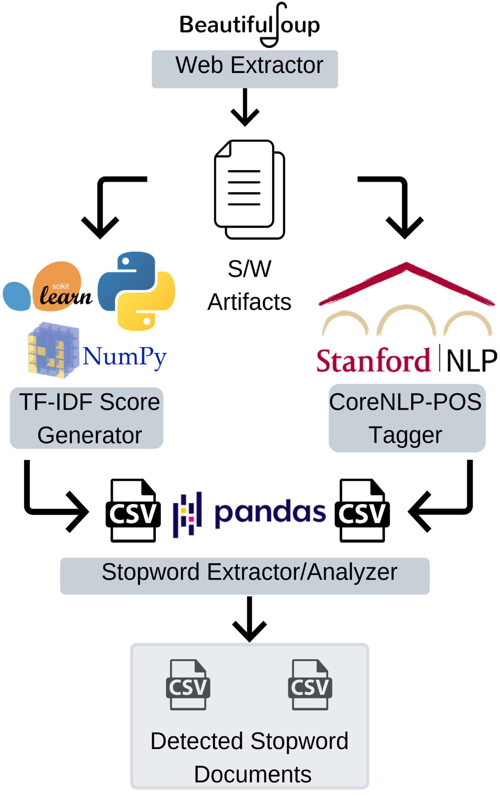

# DynamicStopwords- *An approach towards dynamically generating stopword lists from Software Engineering Artifacts.* 

## This capstone research project entails the following five components together making up the tool :- 
1.	**Web Extractor/Text Scraper**-  Web scraper that produces text files from HTML Pages
2.	**Score Generator**- Produces TF-IDF Scored CSV files for each document in I/P folder
3.	**POS Tagger**- Produces 'part of speech' tagged CSV files for each document in I/P folder
4.	**Stopword Extractor**- Produces Stopword list CSV files for each document in I/P folder
5.	**Result Analyzer**- Produces Visualization by comparing tool detected stopwords W/ Scikit Learn’s list of English Stopwords.

 ***Each file generated by the different components of this tool are automatically grouped within appropriate folders to ensure that they can be used for further analysis if needed.***  

***Of these above listed components, 3 Components (Score Generator, POS Tagger and Stopword Extractor) each create folders containing intermediary files  which are then used by subsequent components and are listed as follows:-*** 
1.	**Score Generator** ->> ‘Scored_files’ & ‘Filtered_files’
2.	**POS Tagger** ->> ‘POS_output’
3.	**Stopword Extractor** ->> ‘Required_results’

## Folder Descriptions:- 
1.	**Input_files**- Contains all I/P Text files for Stopword detection and analysis.
2.	**Scored_files**- Contains all scored files generated by the Score Generator. 
3.	**Filtered_files**- Contains all threshold filtered files.
4.	**POS_output**- Contains all 'part of speech' Tagged files from the POS Tagger.
5.	**Required_results**- Contains tool detected stopword list CSV files. 

## Distributions, Libraries and Modules Used within this tool:- 
1.	Anaconda3
2.	python 3.7.3
3.	scikit-learn 0.21.2
4.	pandas 0.24.2
5.	numpy 1.16.4
6.	pathlib2 2.3.4
7.	glob2 0.7
8.	Stanford CoreNLP 4.0.0
9.	matplotlib  3.1.0
10.	Beautifulsoup4 4.7.1

***In order to run this tool the above mentioned dependencies must be installed on the system, Anaconda3 distribution takes care of most of them, except Stanford CoreNLP which needs to be downloaded from https://stanfordnlp.github.io/CoreNLP/index.html and installed separately onto the system.***

***Stanford CoreNLP also requires Java8 to be downloaded and installed on the system.***

## Steps to running the Tool
*Assuming all the above mentioned dependencies are installed on the system, **the following steps must be performed in the exact sequential order as follows:-***

**I.**	Enter the URL of the online document in the Text scraper and run it on terminal window within the project directory to carry out extraction into a text file or directly drop text files into the ‘Input_files’ folder.

**II.**	Open a new terminal window within the project directory and run the Score Generator script using `python TF_IDF_ScoreGenerator.py`

***Prior to carrying out the next step, The Stanford CoreNLP Server needs to be started, which is done so by using the following steps:-***
1.	Open a separate terminal window from the Stanford CoreNLP directory located within the project directory
2.	Type and run the following command `java -mx4g -cp "*" edu.stanford.nlp.pipeline.StanfordCoreNLPServer -annotators "tokenize,ssplit,pos,lemma,parse,sentiment" -port 9000 -timeout 30000`
 
***The Stanford CoreNLP Server should now be running on the system.***

**III.**	Within the same terminal window used to run the score generator, now run POS Tagger script using `python Document_POS_Tagger.py`

**IV.**	In the same terminal window, run the Stopword extractor script using `python Stopword_Extractor.py`

***Within the ‘Required_results’ folder, you’d now find CSV files for each corresponding document that was within the ‘Input_files’ folder.***

----------------------------------------------------------------------------------------------------------------------------

***To carry out Visual Analysis on the obtained result from the tool by comparing with Scikit-Learn’s list of English stopword proceed to the next and final step***

**V.**	In the same terminal window, run the Result analyzer script using `python Result_Analyzer.py`

***A Pie chart would appear visualizing the results and on closing it a final tally count of results would be displayed in the terminal window.***

## Credits and Support
1. [Shimon Johnson](https://www.linkedin.com/in/shimon-johnson-csm®-869a8582/)
2. [Christian Newman](https://github.com/cnewman)
3. [Matthew Lavin](https://github.com/mjlavin80)
4. [Khalid Alnajjar](https://github.com/mokha)
5. [Maitreyi KV](https://www.linkedin.com/in/maitreyi-kv/)
6. [Aditya Vadhavkar](https://github.com/AdityaMV1215)
7. [Nirbhay Pherwani](https://github.com/nirbhayph)
8. [Stanford CoreNLP](https://github.com/stanfordnlp/CoreNLP)
